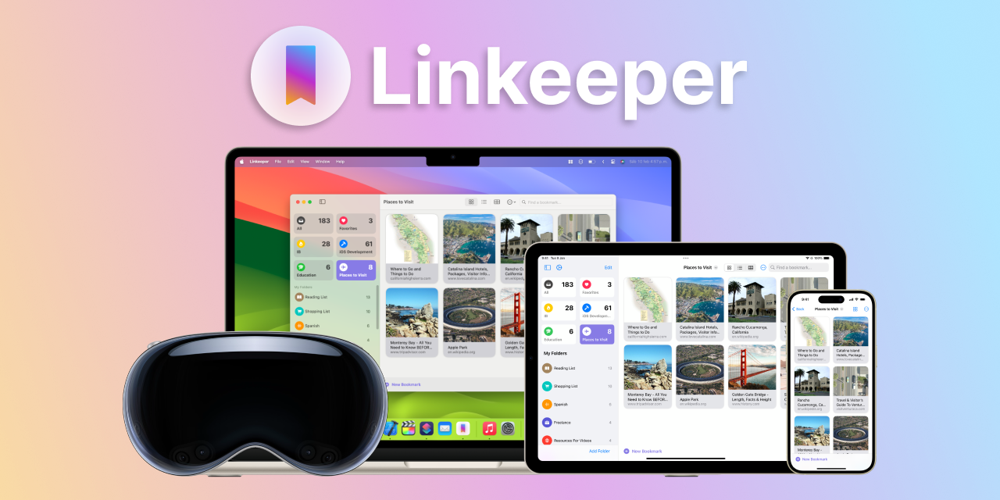

# Linkeeper


<a href=https://apps.apple.com/app/linkeeper/id6449708232 target="_blank">
  
</a>

Linkeeper is a versatile web bookmarking tool designed to help users manage their web links efficiently across multiple devices. It allows users to organize bookmarks into custom categories, offering various display options and seamless integration across iOS, iPadOS, visionOS and macOS.

## Features

- **Bookmark Folders**: Organize bookmarks into custom folders for easy access.
- **Multiple Display Options**: Choose between grid, list, and tabular views to manage bookmarks.
- **Cross Platform Support**: Supports iPhone, iPad, Mac, and Apple Vision.
- **iCloud Sync**: Sync your bookmarks across all your Apple devices.
- **Siri Shortcuts**: Extensive Siri Shortcuts actions for quick access and automation.
- **Markdown Export**: Export bookmarks in Markdown format for easy backup and sharing.
- **Widgets**: Access your bookmarks via widgets on the home screen, desktop, and notification center.
- **Privacy Focused**: No user data is collected, ensuring your information remains private.

## Installation

To build the project locally:

1. **Clone the repository:**
    ```bash
    git clone https://github.com/iTechEverything/linkeeper.git
    ```
2. **Navigate to the project directory:**
    ```bash
    cd linkeeper
    ```
3. **Open the project in Xcode:**
    ```bash
    open Linkeeper.xcodeproj
    ```
4. **Install dependencies:**
    Linkeeper uses several Swift packages. Ensure you have Xcode configured to resolve these dependencies.

5. **Build and run the project:**
    - Select the Linkeeper target.
    - Choose your preferred simulator or connected device.
    - Click the Run button or press `Cmd + R`.

Download Linkeeper from the [App Store](https://apps.apple.com/app/linkeeper/id6449708232).

## Usage

1. **Adding Bookmarks:**
    - Use the "Add Bookmark" button to save new URLs.
    - Organize them into custom categories for easy access.

2. **Managing Bookmarks:**
    - Use the different display options (grid, list, tabular) to view your bookmarks.
    - Edit or delete bookmarks as needed.

3. **Sync and Export:**
    - Enable iCloud Sync to keep your bookmarks updated across all devices.
    - Use the export feature to save your bookmarks in Markdown format.

## Contributing

We welcome contributions from the community! To contribute:

1. Fork the repository.
2. Create a new branch for your feature or bug fix:
    ```bash
    git checkout -b feature-name
    ```
3. Make your changes and commit them:
    ```bash
    git commit -m "Description of your feature or fix"
    ```
4. Push to your branch:
    ```bash
    git push origin feature-name
    ```
5. Create a Pull Request on GitHub.

## Open Source Packages Used

Linkeeper leverages several open-source packages to enhance its functionality:

- **[Pow](https://github.com/EmergeTools/Pow)**: A powerful framework with delightful SwiftUI animations. | Used for the "poof" effect when deleting a bookmark
- **[SimpleToast](https://github.com/sanzaru/SimpleToast)**: A simple toast message library for SwiftUI. | Used for "Added Bookmark" and "Added Folder" pop ups.
- **[SwiftSoup](https://github.com/scinfu/SwiftSoup)**: A Swift library for working with real-world HTML. | Used for importing and parsing HTML files from Chrome and Safari.
- **[SwiftUI-Shimmer](https://github.com/markiv/SwiftUI-Shimmer)**: A SwiftUI modifier for creating shimmer effects. | Used to indicate progress throughout the app.

## Acknowledgments

Linkeeper is developed and maintained by [Starlight Apps LLP](https://starlightapps.org).


## Contact

For any inquiries or feedback, please open an issue on GitHub or contact us at contact@starlightapps.org.

## License

This project is licensed under the MIT License - see the [LICENSE](LICENSE) file for details.

---

**Happy bookmarking!**
